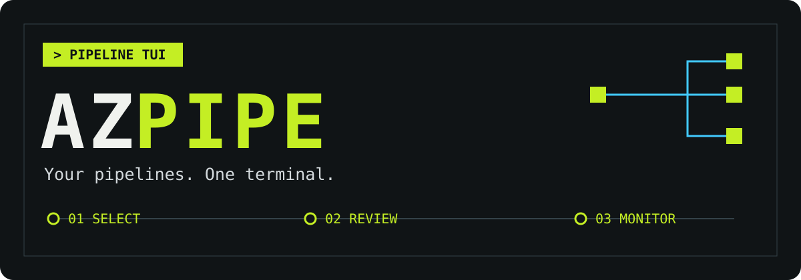
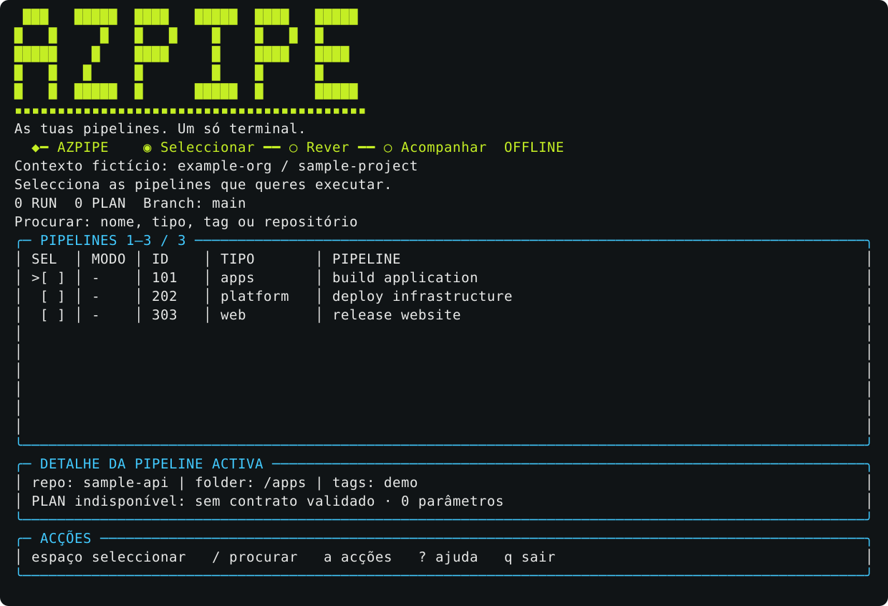

[Português](README.md) | [English](README.en.md)

# azpipe



Selecciona e executa várias pipelines Azure DevOps numa TUI, com revisão antes de lançar e acompanhamento por run. Mantém também uma CLI para automação e análise.

## Experimentar primeiro

Requer Go **1.26.3+** e um terminal interactivo. Na raiz deste checkout:

```bash
go run . demo
```

A demo usa dados fictícios, sem credenciais, chamadas ao Azure DevOps ou escrita de perfis no disco. Consulta o [guião visual](docs/demo.md).



## O que faz

- Lista única com filtros por nome, tipo, pasta, repositório, ID e tags.
- Selecção múltipla, RUN/PLAN por pipeline, formulários tipados e perfis reutilizáveis.
- Revisão de branch, SHA, parâmetros enviados e preview antes da confirmação exacta `EXECUTAR`.
- Até quatro pedidos em paralelo, estado e URL por run, histórico retomável sem ressubmissão.
- CLI para lotes, histórico, análise e consulta de pipelines.

**PLAN exige um contrato explícito revisto pelo responsável da pipeline.** Uma preview expande YAML; não prova ausência de efeitos laterais. A preparação fixa o SHA e a revisão da definição, mas não congela serviços ou referências externas.

Não substitui Azure DevOps, não cancela runs remotas e não executa Terraform localmente. Formulários suportam o YAML raiz em Azure Repos Git, não pipelines clássicas nem fontes Git externas.

## Instalar e abrir

### Comando disponível em qualquer directório (macOS / Linux / WSL)

Com Go 1.26.3+, executa na raiz do repo:

```bash
mkdir -p "$HOME/.local/bin"
go build -o "$HOME/.local/bin/azpipe" .
export PATH="$HOME/.local/bin:$PATH"
azpipe --help
azpipe demo
```

O build instala a versão deste checkout e substitui um binário `azpipe` existente nesse destino. Não actualiza automaticamente: repete o build depois de actualizar o código.

Se a pasta ainda não estiver no `PATH` dos novos terminais, acrescenta uma única vez `export PATH="$HOME/.local/bin:$PATH"` ao `~/.zshrc` (zsh) ou `~/.bashrc` (bash) e abre um terminal novo. Em bash login, confirma que o perfil carrega o `.bashrc`. Não é necessário `sudo`.

Depois, em qualquer directório:

```bash
azpipe          # Abrir a TUI
azpipe --help   # Ajuda; também aceita -h
azpipe demo     # Experimentar offline, sem lançar pipelines
command -v azpipe
```

### Executar sem instalar

Para usar exactamente o código deste checkout:

```bash
go build -o azpipe .
./azpipe
```

A TUI pede organização e projecto. Para instalar a versão **publicada**, que pode ainda não incluir estas alterações:

```bash
go install github.com/ineslino/azpipe@latest
```

Usa `AZDO_PAT` injectado pelo teu mecanismo de credenciais e `AZDO_ORG` para o contexto. Não coloques tokens em exemplos, perfis ou parâmetros. O comando legado `auth set` persiste o PAT; não é a opção recomendada. O adaptador opcional `azdo-as`, as permissões e os contratos PLAN estão no [guia operacional](docs/usage.md).

## Utilização

| Tecla | Acção |
| --- | --- |
| `a` / `?` | Menu de acções e ajuda, com descrições e motivos de indisponibilidade |
| Setas / `j` / `k` | Navegar |
| `/` / espaço | Filtrar / seleccionar |
| `m` / `P` / `R` | Alternar modo / PLAN para selecção / RUN para selecção |
| `e` / `b` | Parâmetros tipados / branch |
| `s` / `l` / `h` | Guardar perfil / carregar perfil / histórico |
| Enter / Esc | Rever / regressar sem lançar |

Exemplo CLI, apenas preview de um ficheiro de selecção preparado conforme o guia:

```bash
./azpipe batch --file selection.json --org example-org --project sample-project
./azpipe --help
```

Perfis guardam parâmetros em texto simples. Nunca incluas segredos. Sair da monitorização não cancela runs aceites; submissões sem ID ficam incertas e nunca são repetidas automaticamente.

## Arquitectura e validação

`cmd` liga a CLI aos serviços em `internal/runner`; `internal/azdo` trata a API e os contratos. A TUI vive em `internal/tui/runner`, separada da lógica de execução. `internal/analysis` e `internal/ui` suportam análise e visualização.

```bash
go test -race ./...
go vet ./...
go build ./...
```

Os testes HTTP usam servidores locais. CI está configurada para Linux/macOS e compilação Windows. Isto não prova execução nativa Windows/WSL nem integração real num ambiente empresarial. Ver [validação e publicação](docs/readiness.md) e [contribuição](CONTRIBUTING.md).

## Documentação

- [Guia operacional completo (EN)](docs/usage.md): autenticação, contratos, parâmetros, perfis, CLI e limites.
- [Demo e imagens](docs/demo.md).
- [Validação, distribuição e pendências](docs/readiness.md).
- [Metadados propostos, não aplicados](docs/repository-metadata.md).
- [Contribuição](CONTRIBUTING.md), [segurança](SECURITY.md) e [changelog](CHANGELOG.md).
- Histórico, não contrato actual: [desenho inicial](docs/superpowers/specs/2026-08-04-pipeline-runner-tui-design.md) e [plano inicial](docs/superpowers/plans/2026-08-04-pipeline-runner-tui.md).

## Licença

[MIT](LICENSE), preservada do repositório existente.
