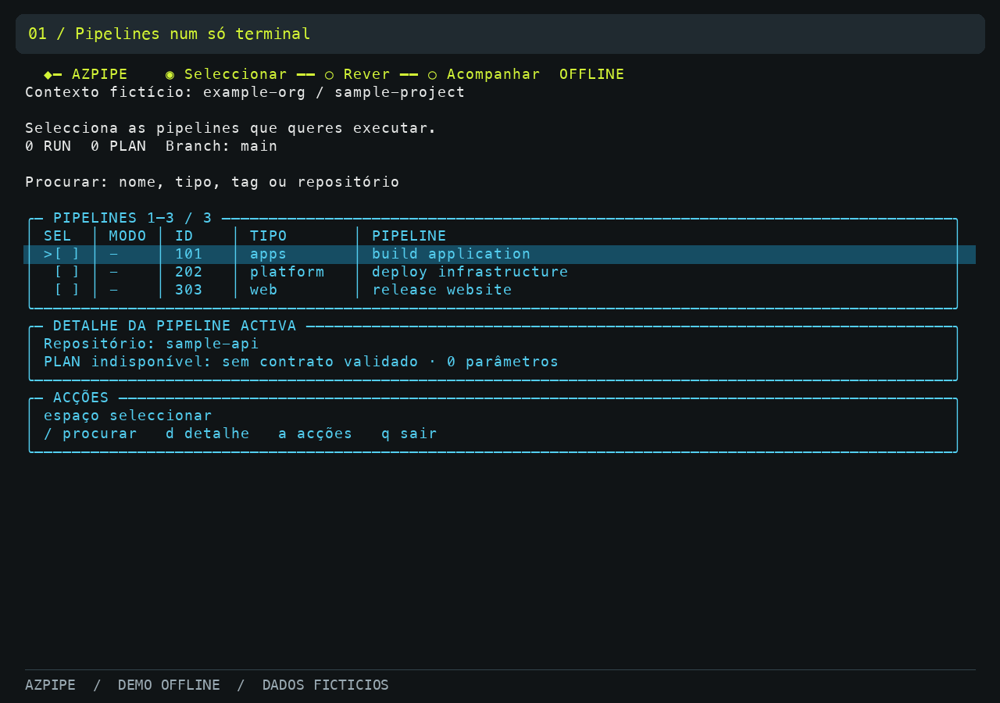

# Demo / Visual walkthrough

## Animação para partilha / Shareable animation



[Descarregar MP4 / Download MP4](assets/azpipe-demo.mp4) · 39 segundos · 1280×900 · sem som / silent.

A animação mostra o catálogo, filtro, selecção PLAN, revisão de parâmetros, histórico fictício, tabela de branches, filtro por criador e revisão da eliminação. São vistas reais do modelo TUI, accionadas por teclas programáticas e renderizadas com uma paleta simplificada. Não é uma gravação de uma sessão Azure DevOps: não demonstra login, descoberta de projectos nem execução remota. O histórico mostrado é estático. Não são usados dados ou credenciais de utilizadores.

The animation renders actual offline TUI model views, driven by scripted key events, using a simplified palette. It demonstrates catalog filtering, PLAN selection, review, fictional history and branch management. It does not demonstrate authentication, project discovery or remote execution.

Para regenerar, na raiz do repo, com Go, Python 3 + Pillow e FFmpeg instalados:

```bash
python3 scripts/demo-animation/render.py
```

O script valida os ecrãs esperados e gera `docs/assets/azpipe-demo.gif`, `azpipe-demo.mp4` e `demo-review.png`. Usa Menlo no macOS ou DejaVu Sans Mono no Linux; podes definir `DEMO_FONT` com o caminho de outra fonte monoespaçada. Os ficheiros temporários são removidos no fim. O GIF é incorporável no README e o MP4 pode ser enviado como anexo aos colegas.

## PT

Na fase de acompanhamento, a tabela separa estado e pipeline. Usa ↑/↓ para escolher a run: o bloco de detalhe mostra o nome completo, a URL ou o erro dessa run; ←/→ permite percorrer texto longo. Em terminais altos há uma linha em branco entre runs. A demo usa dados fictícios e não executa pipelines.

Na raiz do checkout, com Go 1.26.3+ e terminal de pelo menos 80×24:

```bash
go run . demo
```

1. Abre `a` ou `?` para descobrir acções com descrições. Setas escolhem, Enter abre e Esc volta. Usa as setas e espaço na lista para seleccionar pipelines.
2. Experimenta `/` para filtrar; Enter termina a edição.
3. Numa pipeline seleccionada com contrato, `m` alterna RUN/PLAN.
4. `e` abre parâmetros fictícios; Tab navega e Ctrl+S guarda na sessão.
5. Enter abre a revisão de exemplo. Outro Enter mostra um exemplo estático de acompanhamento, sem executar a selecção. Esc regressa ao catálogo mantendo a selecção.
6. `s` e `l` demonstram perfis em memória; `h` mostra um lote fictício de estados mistos.
7. `B` abre a tabela de branches. `u` filtra por criador; espaço selecciona e Enter abre a revisão. A branch principal aparece protegida. Esc volta à lista e outro Esc regressa ao catálogo. `q` sai da aplicação a partir da lista.
8. `q` sai do catálogo.

A demo não cria cliente Azure DevOps, não pede credenciais nem grava perfis no disco. O histórico fictício é estático, não uma execução real.

A marca permanece compacta durante o trabalho. `d` abre os metadados completos da pipeline; nas branches, `?` mostra as acções secundárias e ←/→ percorre os detalhes. `NO_COLOR` desactiva cores. A gravação termina com um cartão editorial de encerramento; os oito momentos anteriores são vistas do modelo TUI.

## EN

Run `go run . demo` from the checkout in an interactive terminal (Go 1.26.3+, at least 80×24). Use arrows and Space to select, `/` to filter, `m` for RUN/PLAN on a selected contracted pipeline, and `e` for fixture parameters (Tab to move, Ctrl+S to save). Enter opens review; another Enter shows a static fictional batch, independent of your selection. Esc returns and preserves the selection. Profiles (`s`/`l`) are memory-only; `h` also opens fictional history. Press `B` for branches, Esc to return to the catalog from the branch list, and `q` to quit either list.

No Azure DevOps client, credentials, network calls or profile files are involved. Press `a` or `?` to discover actions, use arrows and Enter, and Esc to return. Branding stays compact. `d` opens pipeline metadata; `?` opens branch help. The final recording frame is an editorial end card, not an application screen. `NO_COLOR` is respected.

## Imagens / Images

[Preview at README width](assets/preview.html), including links to full-size assets. Open the HTML locally; no server or network is required.


These are deterministic renders of the actual Bubble Tea model views, with a simplified documentation palette, not screenshots of Azure runs. The hero is an original vector composition, not a product screenshot. Regenerate model renders from the repository root:

```bash
go run ./scripts/render-demo
```

The renderer uses existing Go dependencies, fictional fixtures, no credentials and no API client. It overwrites only `docs/assets/welcome.svg` and `docs/assets/catalog.svg`.
