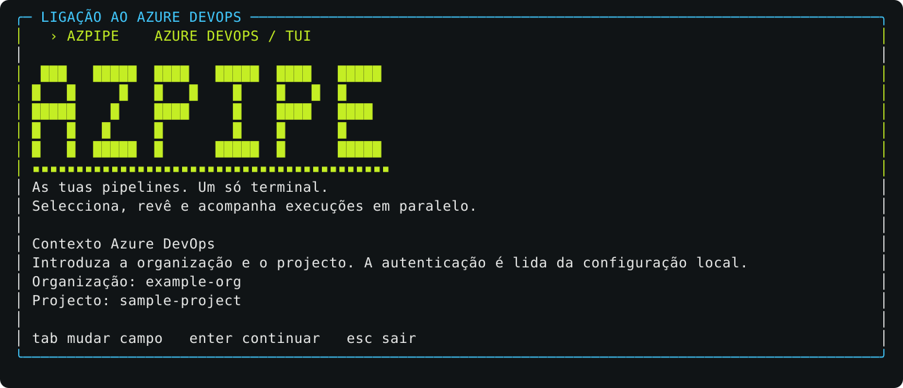

# Demo / Visual walkthrough

## PT

Na raiz do checkout, com Go 1.26.3+ e terminal de pelo menos 80×24:

```bash
go run . demo
```

1. Abre `a` ou `?` para descobrir acções com descrições. Setas escolhem, Enter abre e Esc volta. Usa as setas e espaço na lista para seleccionar pipelines.
2. Experimenta `/` para filtrar; Enter termina a edição.
3. Numa pipeline seleccionada com contrato, `m` alterna RUN/PLAN.
4. `e` abre parâmetros fictícios; Tab navega e Ctrl+S guarda na sessão.
5. Enter abre a revisão. Esc regressa sem lançar.
6. `s` e `l` demonstram perfis em memória; `h` mostra um lote fictício de estados mistos.
7. `q` sai do catálogo.

A demo não cria cliente Azure DevOps, não pede credenciais nem grava perfis no disco. O histórico fictício é estático, não uma execução real.

A faixa grande aparece também no catálogo e na demo com pelo menos 60 colunas e 32 linhas. Em terminais mais baixos, a marca e descrição ficam compactas para preservar a tabela. `NO_COLOR` desactiva cores; respeitamos essa opção.

## EN

Run `go run . demo` from the checkout in an interactive terminal (Go 1.26.3+, at least 80×24). Use arrows and Space to select, `/` to filter, `m` for RUN/PLAN on a selected contracted pipeline, and `e` for fixture parameters (Tab to move, Ctrl+S to save). Enter opens review; Esc returns. Profiles (`s`/`l`) are memory-only; `h` shows a static fictional batch. Quit the catalog with `q`.

No Azure DevOps client, credentials, network calls or profile files are involved. Press `a` or `?` to discover actions, use arrows and Enter, and Esc to return. The large banner also appears in the catalog/demo at 60+ columns and 32+ rows; shorter terminals keep a compact identity and description. `NO_COLOR` is respected.

## Imagens / Images

[Preview at README width](assets/preview.html), including links to full-size assets. Open the HTML locally; no server or network is required.




These are deterministic renders of the actual Bubble Tea model views, with a simplified documentation palette, not screenshots of Azure runs. The hero is an original vector composition, not a product screenshot. Regenerate model renders from the repository root:

```bash
go run ./scripts/render-demo
```

The renderer uses existing Go dependencies, fictional fixtures, no credentials and no API client. It overwrites only `docs/assets/welcome.svg` and `docs/assets/catalog.svg`.
